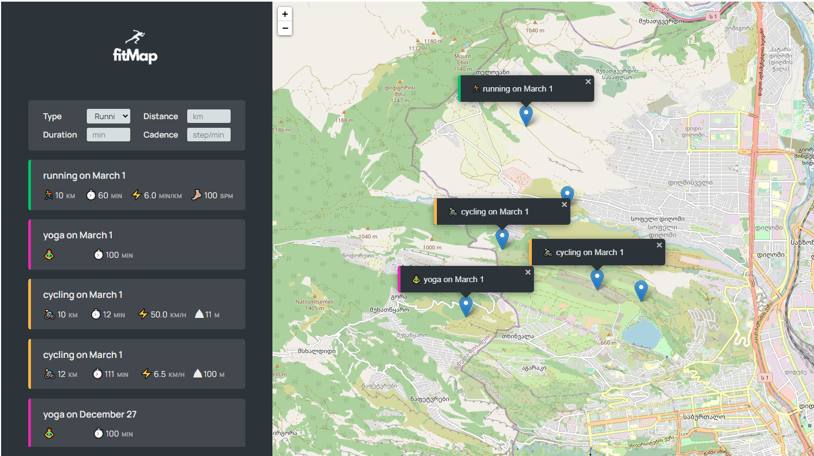

This is a small application for tracking workouts on Map.

Users should be able to:

- View the optimal layout for each of the website's pages depending on their device's screen size
-  Track  and save 4 types of workouts, running, cycling, hiking and yoga.
- Save workout related data (distance, duration and cadence for hiking and running,  distance, duration and elevation for cycling and duration for yoga);

### Screenshot

### Links

- Live Site URL: [https://fitmapfinal.netlify.app/]

### Built with

- Semantic HTML5 markup
- CSS custom properties
- JavaScript

